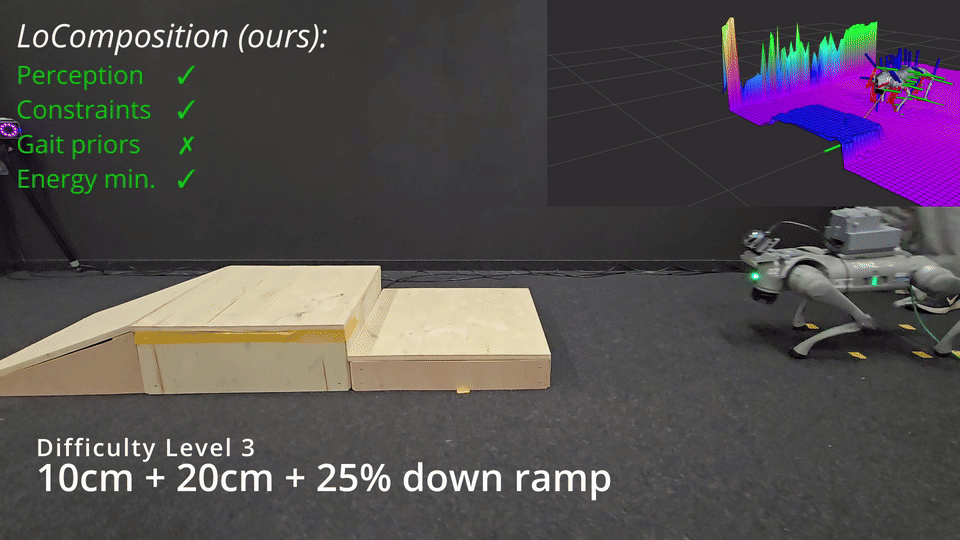

# LoComposition

### Terrain-Adaptive Energy-Efficient Quadruped Locomotion without Gait Priors

[Project page](https://sites.google.com/view/locomposition) · [Paper](https://arxiv.org/abs/2606.15896) · [Project video](https://youtu.be/byAA07ge4O0)


LoComposition learns efficient rough-terrain locomotion without air-time targets, contact-count objectives, foot-clearance rewards, or a prescribed gait. The training formulation gives each concern one clear role: rewards specify the task, constraints encode operational limits, mechanical-energy minimization provides a gait preference, and exteroceptive perception makes that preference terrain-aware.



## Cross-embodiment without Re-Tuning:
<p align="center">
  
  
</p>

## Why LoComposition

Quadruped locomotion rewards often mix command tracking, actuator limits, smoothness, foot timing, clearance, and terrain handling into one weighted objective. LoComposition separates them:

- **Task specification:** rewards track commanded planar and yaw velocity.
- **Operational limits:** [Constraints as Terminations (CaT)](https://arxiv.org/abs/2403.18765) encodes actuator, action-rate, and posture limits.
- **Gait preference:** mechanical-power minimization favors economical motion without naming a contact pattern.
- **Terrain adaptation:** a robot-centric elevation map lets the policy spend energy where obstacles require it.

The result is an energy-efficient trotting gait that emerges during training and increases clearance when the terrain requires it. CaT is the chosen constraint mechanism for our method, and LoComposition is the complete formulation built around it.

## Results at a glance

Against a conventional complex-reward locomotion baseline, LoComposition provides:

- **56% lower Cost of Transport** with comparable rough-terrain progression;
- **96% fewer operational-limit violations** under the same evaluation thresholds;
- **zero-shot deployment on a Unitree Go2**, using an online LiDAR elevation map and no hardware retraining; and
- **no explicit gait-style priors** in the final policy.


See the paper for more details. The [project page](https://sites.google.com/view/locomposition) and [project video](https://youtu.be/byAA07ge4O0) are the best place to watch the full comparison.

## Installation

The setup script creates a Python 3.11 environment, installs the dependencies recorded in `uv.lock`, and checks out the compatible Isaac Lab source revision. It requires Linux, an NVIDIA GPU with a compatible driver, Git, and enough disk space for Isaac Sim.

```bash
./create-isaac-lab-env-uv.sh locomposition
source ~/mamba_env_data/locomposition/.venv/bin/activate
cd ~/mamba_env_data/locomposition/LoComposition
```

Use `--root PATH` to place the environment elsewhere, or `--repo-source URL_OR_PATH` to install from a fork or local checkout. The script refuses to merge into a non-empty target directory. It finishes by checking the installed dependency graph and printing the locations of the editable LoComposition and Isaac Lab packages.

Reproducibility has two deliberate boundaries:

- `uv.lock` fixes Isaac Sim 5.1.0, PyTorch 2.7.0 with CUDA 12.8, the LoComposition extension, and the remaining Python packages.
- `create-isaac-lab-env-uv.sh` checks out Isaac Lab at `ddb044eb5b2300792de41e82d53b032f3632b489` and installs its four required source packages editably. Keeping this checkout explicit matters because Isaac Lab resolves application files relative to its source tree.

One upstream metadata conflict is handled explicitly: Isaac Sim 5.1 pins a FastAPI version that declares Starlette below 0.46, while this Isaac Lab revision requires the security-updated Starlette 0.49.1. LoComposition keeps Isaac Lab's 0.49.1 requirement, matching the validated development environment. The installer accepts only that exact `uv pip check` warning and still fails on any other dependency incompatibility.

If you already have that Isaac Lab revision installed in an active environment, synchronize LoComposition into it from the repository root. `--inexact` retains the separately installed editable Isaac Lab packages:

```bash
UV_PROJECT_ENVIRONMENT="$VIRTUAL_ENV" uv sync --frozen --inexact
```

### Cluster training

Environment creation also writes two ready-to-review job files beside the virtual environment:

- `train-locomposition.sbatch` runs three 7,500-environment seeds concurrently on one L40S, with eight allocated CPUs.
- `train-locomposition-2080ti.sbatch` runs one seed per 2080 Ti array job, also with eight allocated CPUs.

Authenticate W&B once from the cluster account whose shared home directory is mounted on the compute nodes. This is a one-time login for that account, not a step to repeat for every environment:

```bash
wandb login
sbatch ~/mamba_env_data/locomposition/train-locomposition.sbatch
```

W&B stores that login outside the virtual environment, so new LoComposition environments reuse it. The jobs can also inherit a `WANDB_API_KEY` supplied by your scheduler or secret manager; no credential belongs in this repository or in an sbatch file.

## Quick start

Train the main Go2 policy:

```bash
python scripts/clean_rl/train.py \
  --task=LoComposition-Go2-Rough-Terrain-Joint-State-History-v0 \
  --seed=46 --headless --num_envs=7500
```

Evaluate a checkpoint and record the standard diagnostics:

```bash
python scripts/eval.py \
  --run_dir=/absolute/path/to/training/run \
  --task=LoComposition-Go2-Rough-Terrain-Joint-State-History-Play-v0 \
  --seed=46 --headless
```

Regenerate plots from a saved evaluation:

```bash
python scripts/generate_plots.py \
  --data_file=/absolute/path/to/evaluation/plots/sim_data.npz \
  --output_dir=/absolute/path/to/output/plots
```

The former `CaT-*` task IDs and `cat_envs` Python imports remain available as compatibility aliases. New scripts should use the `LoComposition-*` IDs and `locomposition` package. See the [migration guide](docs/migration.md) for the exact mapping.

## Repository layout

- `exts/locomposition/`: Isaac Lab environments, robot configurations, CaT constraint manager, and CleanRL PPO implementation.
- `scripts/clean_rl/train.py`: training entry point.
- `scripts/eval.py`: checkpoint evaluation, scenario rollouts, and metric collection.
- `scripts/generate_plots.py`: plot regeneration from saved evaluation arrays.
- `sim2real/`: ROS 2 controller, elevation-map processing, launch stack, and traced policies for the Go2.
- `tests/`: naming, compatibility, setup, ROS, plotting, and metric contracts.

## Sim-to-real deployment

The Go2 stack runs policy inference at 50 Hz and republishes the latest PD target from a 500 Hz low-level loop. A Livox MID-360 and `elevation_mapping_cupy` produce the online elevation map, the LoComposition processing node converts it to the same yaw-aligned 13×11 observation used in simulation. Read [sim-to-real deployment guide](docs/sim2real.md) before setting up the hardware.


## Citation and attribution

If LoComposition is useful in your work, please cite:

```bibtex
@article{kordos2026locomposition,
  title   = {LoComposition: Terrain-Adaptive Energy-Efficient Quadruped Locomotion without Gait Priors},
  author  = {Kordos, Loukas and Franz, Leonard T. and Rappenecker, Simon and Hausd{\"o}rfer, Oliver and Schoellig, Angela P. and Kolev, Pavel and Martius, Georg},
  journal = {arXiv preprint arXiv:2606.15896},
  year    = {2026}
}
```

LoComposition uses **Constraints as Terminations** as the mechanism for operational-limit constraints. Please also cite the original CaT paper when using that part of the code:

```bibtex
@inproceedings{chane_sane2024cat,
  title     = {{CaT}: Constraints as Terminations for Legged Locomotion Reinforcement Learning},
  author    = {Chane-Sane, Elliot and Leziart, Pierre-Alexandre and Flayols, Thomas and Stasse, Olivier and Sou{\`e}res, Philippe and Mansard, Nicolas},
  booktitle = {2024 IEEE/RSJ International Conference on Intelligent Robots and Systems (IROS)},
  year      = {2024}
}
```

## License

This repository does not declare one project-wide license yet, but existing source files already may have their notices (BSD-3-Clause/Apache-2.0 in the ROS controller package). Check the relevant file or package before reuse.
