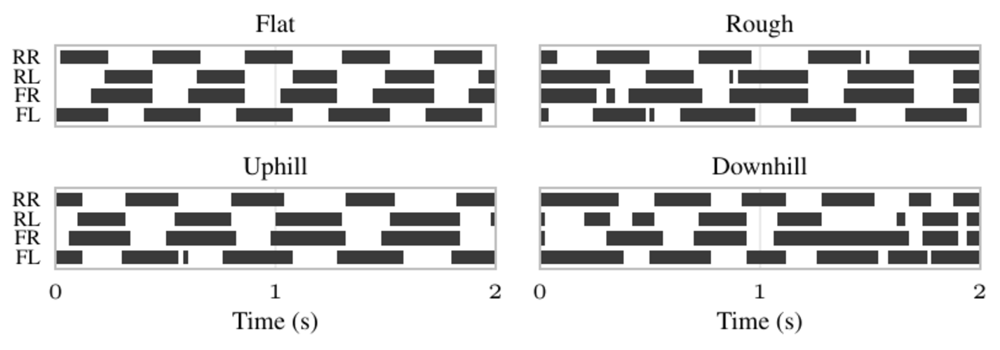

# LoComposition

### Terrain-Adaptive Energy-Efficient Quadruped Locomotion without Gait Priors

[Project page](https://sites.google.com/view/locomposition) · [Paper](https://arxiv.org/abs/2606.15896) · [Project video (on the project page)](https://sites.google.com/view/locomposition)


LoComposition learns efficient rough-terrain locomotion without air-time targets, contact-count objectives, foot-clearance rewards, or a prescribed gait. The training formulation gives each concern one clear role: rewards specify the task, constraints encode operational limits, mechanical-energy minimization provides a gait preference, and exteroceptive perception makes that preference terrain-aware.

## Why LoComposition

Quadruped locomotion rewards often mix command tracking, actuator limits, smoothness, foot timing, clearance, and terrain handling into one weighted objective. LoComposition separates them:

- **Task specification:** rewards track commanded planar and yaw velocity.
- **Operational limits:** [Constraints as Terminations (CaT)](https://arxiv.org/abs/2403.18765) encodes actuator, action-rate, and posture limits.
- **Gait preference:** mechanical-power minimization favors economical motion without naming a contact pattern.
- **Terrain adaptation:** a robot-centric elevation map lets the policy spend energy where obstacles require it.

The result is a low-cost trotting gait that emerges during training and increases clearance when the terrain calls for it. CaT remains an important component of the method; LoComposition is the complete formulation built around it, not a replacement name for the constraint mechanism.

## Results at a glance

Against a conventional complex-reward locomotion baseline, LoComposition provides:

- **56% lower Cost of Transport** with comparable rough-terrain progression;
- **96% fewer operational-limit violations** under the same evaluation thresholds;
- **zero-shot deployment on a Unitree Go2**, using an online LiDAR elevation map and no hardware retraining; and
- **no explicit gait-style priors** in the final policy.


The paper contains the controlled ablations, 12-seed aggregate results, and hardware protocol. The [project page](https://sites.google.com/view/locomposition) is the best place to watch the full qualitative comparison.

## Additional evidence

Follow-up analyses help explain what the headline metrics leave out. On uneven terrain, mean swing height increases from **2.28 cm to 5.72 cm**, while simultaneous diagonal contact decreases from **81% to 56%**. With a 20 ms action delay, planar velocity RMSE changes from 0.19 to 0.26 m/s for LoComposition, compared with 0.17 to 0.47 m/s without energy minimization. In a matched reward-penalty study using the same PPO settings and action scale, the best tested penalty coefficient still produces roughly **15× more torque-limit violations** than the CaT formulation.

These are supporting analyses beyond the current preprint's main headline results; they are kept separate here to avoid presenting them as part of the original comparison.



## Installation

The setup script creates a pinned Python 3.11 environment, installs Isaac Sim 5.1.0 and the matching Isaac Lab revision, clones LoComposition, and installs its dependencies. It requires Linux, an NVIDIA GPU with a compatible driver, Git, and enough disk space for Isaac Sim.

```bash
./create-isaac-lab-env-uv.sh locomposition
source ~/mamba_env_data/locomposition/.venv/bin/activate
cd ~/mamba_env_data/locomposition/LoComposition
```

Use `--root PATH` to place the environment elsewhere, or `--repo-source URL_OR_PATH` to install from a fork or local checkout. The script refuses to merge into a non-empty target directory.

If you already have the pinned Isaac Lab environment, install only this extension and its Python dependencies:

```bash
uv pip install --no-build-isolation --no-deps --editable ./exts/locomposition
uv pip install --requirement requirements.txt
```

## Quick start

Train the main Go2 policy:

```bash
python scripts/clean_rl/train.py \
  --task=LoComposition-Go2-Rough-Terrain-Joint-State-History-v0 \
  --seed=46 --headless --num_envs=7500
```

Evaluate a checkpoint and record the standard diagnostics:

```bash
python scripts/eval.py \
  --run_dir=/absolute/path/to/training/run \
  --task=LoComposition-Go2-Rough-Terrain-Joint-State-History-Play-v0 \
  --seed=46 --headless
```

Regenerate plots from a saved evaluation:

```bash
python scripts/generate_plots.py \
  --data_file=/absolute/path/to/evaluation/plots/sim_data.npz \
  --output_dir=/absolute/path/to/output/plots
```

The former `CaT-*` task IDs and `cat_envs` Python imports remain available as compatibility aliases. New scripts should use the `LoComposition-*` IDs and `locomposition` package. See the [migration guide](docs/migration.md) for the exact mapping.

## Supported robots

Each embodiment uses a separately trained policy. The formulation and training recipe stay the same; action scaling and actuator limits follow the robot, while mass randomization, disturbances, and the energy coefficient are scaled deterministically by the robot's mass ratio. This normalization is not a per-robot hyperparameter search and should not be read as one policy transferring between embodiments.

| Robot | Current evidence | Canonical task prefix |
| --- | --- | --- |
| Unitree Go2 | Simulation and zero-shot hardware deployment | `LoComposition-Go2-*` |
| ANYmal C | Rough-terrain simulation, same formulation | `LoComposition-Anymal-C-*` |
| Boston Dynamics Spot | Rough-terrain simulation, same formulation | `LoComposition-Spot-*` |

The following GIFs are deliberately labelled placeholders until the final website clips are exported:


The requested crops and replacement checklist are in [the asset inventory](docs/assets.md).

## Repository layout

- `exts/locomposition/`: Isaac Lab environments, robot configurations, CaT constraint manager, and CleanRL PPO implementation.
- `scripts/clean_rl/train.py`: training entry point.
- `scripts/eval.py`: checkpoint evaluation, scenario rollouts, and metric collection.
- `scripts/generate_plots.py`: plot regeneration from saved evaluation arrays.
- `sim2real/`: ROS 2 controller, elevation-map processing, launch stack, and traced policies for the Go2.
- `tests/`: naming, compatibility, setup, ROS, plotting, and metric contracts.

## Sim-to-real deployment

The Go2 stack runs policy inference at 50 Hz and republishes the latest PD target from a 500 Hz low-level loop. A Livox MID-360 and `elevation_mapping_cupy` produce the online map; the LoComposition processing node converts it to the same yaw-aligned 13×11 observation used in simulation. The controller includes state/map freshness checks and safe-stop behavior, but it is a soft-real-time research stack—not a formal runtime safety system.

Start with the [sim-to-real deployment guide](docs/sim2real.md) before connecting to hardware.


## Citation and attribution

If LoComposition is useful in your work, please cite:

```bibtex
@article{kordos2026locomposition,
  title   = {LoComposition: Terrain-Adaptive Energy-Efficient Quadruped Locomotion without Gait Priors},
  author  = {Kordos, Loukas and Franz, Leonard T. and Rappenecker, Simon and Hausd{\"o}rfer, Oliver and Schoellig, Angela P. and Kolev, Pavel and Martius, Georg},
  journal = {arXiv preprint arXiv:2606.15896},
  year    = {2026}
}
```

LoComposition uses **Constraints as Terminations** as the mechanism for operational-limit constraints. Please also cite the original CaT paper when using that part of the code:

```bibtex
@inproceedings{chane_sane2024cat,
  title     = {{CaT}: Constraints as Terminations for Legged Locomotion Reinforcement Learning},
  author    = {Chane-Sane, Elliot and Leziart, Pierre-Alexandre and Flayols, Thomas and Stasse, Olivier and Sou{\`e}res, Philippe and Mansard, Nicolas},
  booktitle = {2024 IEEE/RSJ International Conference on Intelligent Robots and Systems (IROS)},
  year      = {2024}
}
```

The CaT/Isaac Lab foundation of this fork was originally implemented by Constant Roux and Maciej Stępień. The [original repository](https://github.com/Gepetto/constraints-as-terminations), [CaT paper](https://arxiv.org/abs/2403.18765), and [CaT project page](https://constraints-as-terminations.github.io) remain the authoritative sources for that prior work. Machine-readable LoComposition citation metadata is available in [CITATION.cff](CITATION.cff).

## License

This repository does not yet declare one project-wide license. Existing source files retain their file-level notices (predominantly BSD-3-Clause, with Apache-2.0 in the ROS controller package). Check the relevant file or package before reuse. Selecting and adding the final top-level license is listed in the [migration checklist](docs/migration.md#repository-owner-checklist).
